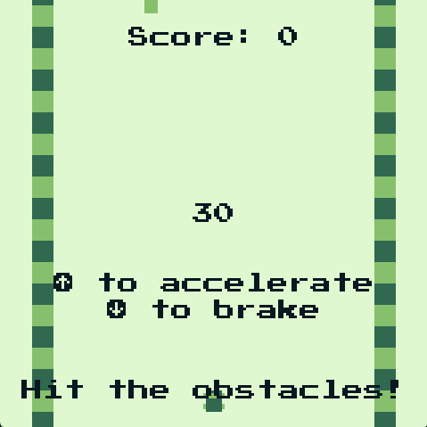

# Unknown Car Game for WASM-4

A game written in Rust for the [WASM-4] fantasy console.  
A kind of lo-fi port of my prototype game [Unknown Car Game].

<p align="center">
    
</p>

**:rocket: [Play it here!](https://srynetix.github.io/wasm4-unknown-car-game/)**  
**:book: [Read the engine documentation here!](https://srynetix.github.io/wasm4-sx/wasm4_sx/)**

## Dependencies

- The [WASM-4] CLI (`w4`)
- A stable [Rust] compiler with the `wasm32-unknown-unknown` target
- The [Just] command runner

For release builds:
- The `wasm-opt` tool from the [binaryen] project
- The `wasm-strip` tool from the [wabt] project

For WASM analysis (`analyze` tasks):
- Optionally, for WASM analysis, the [twiggy] tool

## Building and running

You can type `just` to see the different build and export tasks.  
Here are some examples:

```sh
# Build the cartridge in release mode + strip and run WASM-4 on web
just run-release-web

# Build the cartridge in release mode + strip and run WASM-4 on native mode
just run-release-native

# Build the cartridge in release mode + strip and export to HTML file
just export-release-web

# Build the cartridge in release mode + strip and export to Windows EXE file
just export-release-exe
```

[WASM-4]: https://wasm4.org
[Unknown Car Game]: https://github.com/Srynetix/unknown-car-game
[Rust]: https://www.rust-lang.org/
[binaryen]: https://github.com/WebAssembly/binaryen
[wabt]: https://github.com/WebAssembly/wabt
[Just]: https://github.com/casey/just
[twiggy]: https://github.com/rustwasm/twiggy
